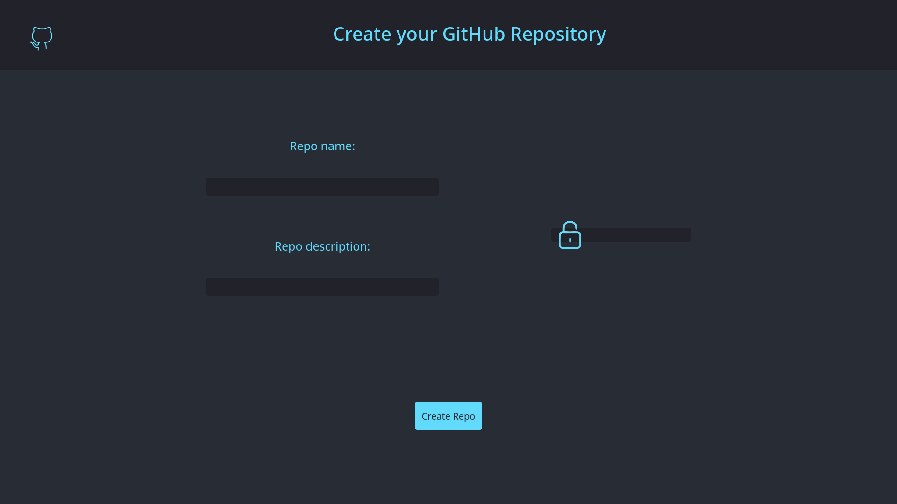
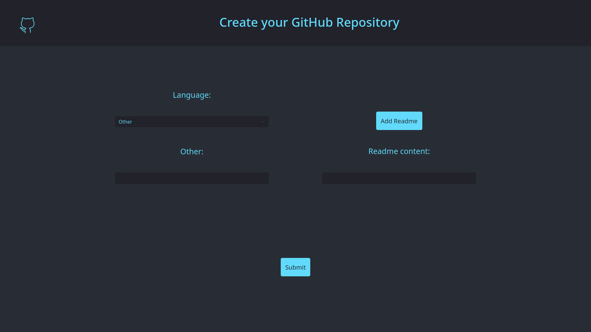
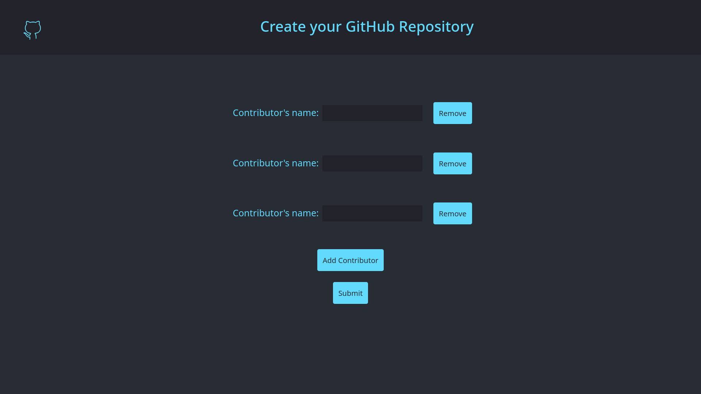

# GitHub WebApp

## Overview

GitHub WebApp is a web application that allows users to create GitHub repositories, add files to them, and collaborate with contributors. This project features a React-based frontend and a Flask-based backend, with the primary goal of serving as a learning exercise to explore new technologies and development techniques.

## Features

- **Create GitHub Repository**: Users can create a new GitHub repository by providing a name, description, and privacy settings.

- **Add Files**: Once a repository is created, users can add files to it. Supported languages include Python, Java, C, C++, and JavaScript.

- **Collaborate with Contributors**: Users can invite collaborators to their repositories, allowing them to contribute code.

## Usage

Access the web application by opening your browser and navigating to http://localhost:3000 (assuming the React development server is running).

Use the GitHub WebApp to create repositories, add files, and invite collaborators.

## Website Screenshots

Here are some screenshots of our GitHub WebApp:

<!-- Slide 1 -->

<!-- Slide 2 -->

<!-- Slide 3 -->

<!-- Slide 4 -->

## Browser Compatibility
This website is currently optimized for use with the Mozilla Firefox web browser. While it may work in other browsers, I recommend using Firefox for the best experience.

## Acknowledgments

This project was inspired by the desire to learn and experiment with React, Flask, and the GitHub API. Special thanks to the open-source community for providing valuable resources and documentation.

Disclaimer: This project is not intended for production use and is primarily a learning exercise. The use of the GitHub API in this project is subject to GitHub's terms of service and rate limits. Be sure to use your own GitHub API token for testing, and be mindful of API rate limits when making requests.
